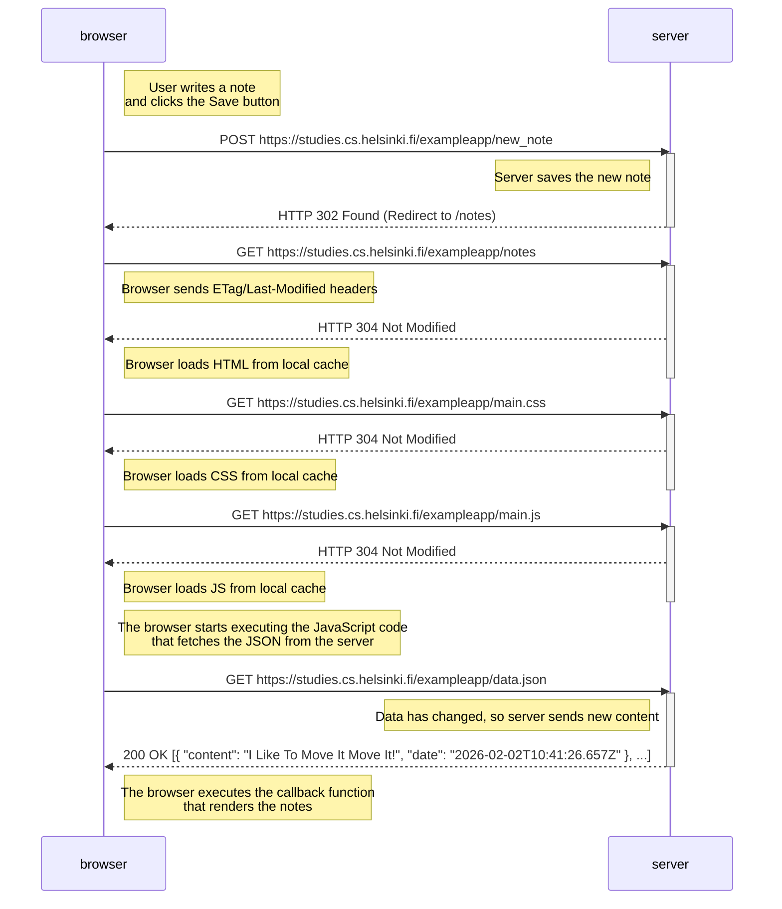

```mermaid
sequenceDiagram
    participant browser
    participant server

    Note right of browser: User writes a note<br/>and clicks the Save button

    browser->>server: POST https://studies.cs.helsinki.fi/exampleapp/new_note
    activate server
    Note left of server: Server saves the new note
    server-->>browser: HTTP 302 Found (Redirect to /notes)
    deactivate server

    browser->>server: GET https://studies.cs.helsinki.fi/exampleapp/notes
    activate server
    Note right of browser: Browser sends ETag/Last-Modified headers
    server-->>browser: HTTP 304 Not Modified
    Note right of browser: Browser loads HTML from local cache
    deactivate server

    browser->>server: GET https://studies.cs.helsinki.fi/exampleapp/main.css
    activate server
    server-->>browser: HTTP 304 Not Modified
    Note right of browser: Browser loads CSS from local cache
    deactivate server

    browser->>server: GET https://studies.cs.helsinki.fi/exampleapp/main.js
    activate server
    server-->>browser: HTTP 304 Not Modified
    Note right of browser: Browser loads JS from local cache
    deactivate server

    Note right of browser: The browser starts executing the JavaScript code<br/>that fetches the JSON from the server

    browser->>server: GET https://studies.cs.helsinki.fi/exampleapp/data.json
    activate server
    Note left of server: Data has changed, so server sends new content
    server-->>browser: 200 OK [{ "content": "I Like To Move It Move It!", "date": "2026-02-02T10:41:26.657Z" }, ...]
    deactivate server

    Note right of browser: The browser executes the callback function<br/>that renders the notes
```