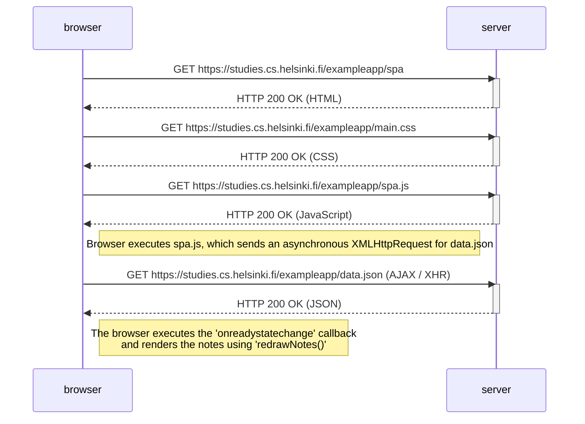

```mermaid
sequenceDiagram
    participant browser
    participant server

    browser->>server: GET https://studies.cs.helsinki.fi/exampleapp/spa
    activate server
    server-->>browser: HTTP 200 OK (HTML)
    deactivate server

    browser->>server: GET https://studies.cs.helsinki.fi/exampleapp/main.css
    activate server
    server-->>browser: HTTP 200 OK (CSS)
    deactivate server

    browser->>server: GET https://studies.cs.helsinki.fi/exampleapp/spa.js
    activate server
    server-->>browser: HTTP 200 OK (JavaScript)
    deactivate server

    Note right of browser: Browser executes spa.js, which sends an asynchronous XMLHttpRequest for data.json

    browser->>server: GET https://studies.cs.helsinki.fi/exampleapp/data.json (AJAX / XHR)
    activate server
    server-->>browser: HTTP 200 OK (JSON)
    deactivate server

    Note right of browser: The browser executes the 'onreadystatechange' callback<br/>and renders the notes using 'redrawNotes()'
```
