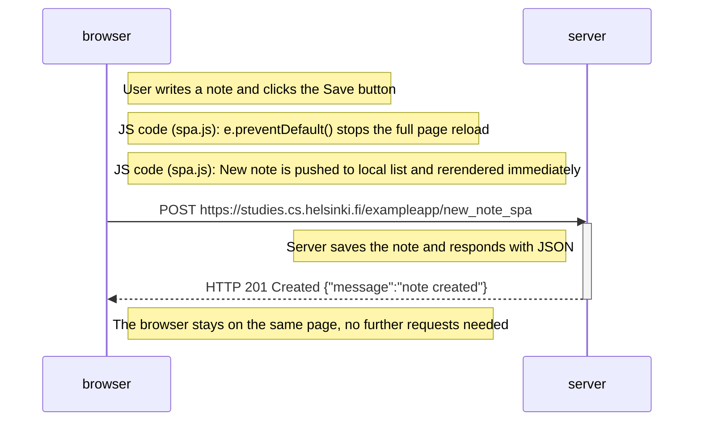

```mermaid
sequenceDiagram
    participant browser
    participant server

    Note right of browser: User writes a note and clicks the Save button

    Note right of browser: JS code (spa.js): e.preventDefault() stops the full page reload
    Note right of browser: JS code (spa.js): New note is pushed to local list and rerendered immediately

    browser->>server: POST https://studies.cs.helsinki.fi/exampleapp/new_note_spa
    activate server
    Note left of server: Server saves the note and responds with JSON
    server-->>browser: HTTP 201 Created {"message":"note created"}
    deactivate server

    Note right of browser: The browser stays on the same page, no further requests needed
```
